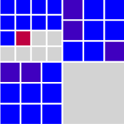
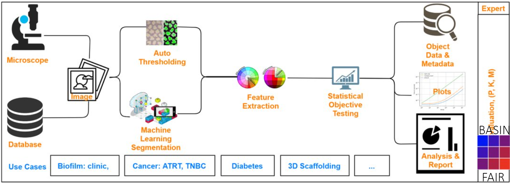
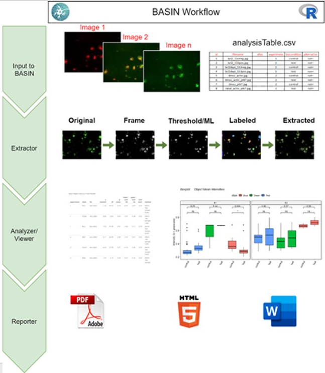
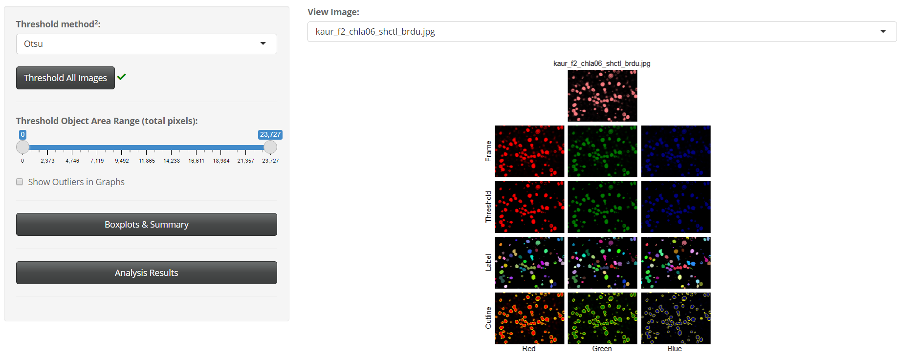

   `FAIR Assessment`_
.. _FAIR Assessment: https://fairshake.cloud/project/130/stats/

=================
Welcome to BASIN!
=================

---------
Objective
---------

In order to assist researchers with quantitative, objective analysis of experiments
involving cell treatment and/or movement, we have developed a suite of applications
under the BASIN Project.

BASIN is a set of R packages that utilize R Shiny to provide a user interface
for statistical analysis of two-dimensional confocal microscope images. Users
can upload two images directly or a folder of images with the help of a
user-generated csv file, edit their experimental design, create tables and
graphs for analysis results, and generate a fully-formatted report of their
experiment. Source code for the BASIN applications can be found at our Github
repository at https://github.com/bicbioeng/BASIN.

------------
Publication
------------

Our paper is currently under review and final revision. We aim to be published by the end of summer 2021.

=========
Tutorials
=========

---------
Workflow
---------

Here is an abstract illustration of the experimental workflow in the BASIN application. Two sources of images and two types of image processing techniques can be used.
First, desired features are extracted from the processed images. Then, statistical analytical tools are used to present the comparable results.

Visualized below is the schematic overview of the BASIN workflow. As indicated, the application
is divided into four main modules: Input, Extraction, Analysis and Visualization, and Reporting.

Users upload their images and download an experimental design template in the Input module. After
customizing their experimental design table, users will upload it to BASIN and begin their analysis.
The experimental design table allows images to be separated into experimental groups and further divided into two
condition groups - control and test. BASIN will perform a statistical comparison between
the control and test images across each experimental group, allowing multiple different
analyses to be performed concurrently. Users can also provide staining information
for the RGB color frame of interest - for example, DAPI for blue and GFP for green.

In the Extractor module, users can select one of seventeen thresholding algorithms to apply to their images.
After thresholding, BASIN will segment, outline, and label unique cell objects found.
Morphological features of these cell objects are extracted and summary statistics displayed for users.
Below is a sample extraction sequence for an image analyzed in BASIN using the Otsu
thresholding algorithm:

In the Analysis and Viewer module, statistical comparison between experimental groups
is performed to determine significant differences between the control and test images.
The two features tested are mean intensity and cell surface area, which are the most
common features compared during experimental analysis. We also provide the differences
in aggregate cell counts and net image intensity as simpler measures for determining significant
variations between the control and test groups. Results are displayed in both tabular
and graphical format, and the entire workflow is sequentially outlined in the Viewer
section of BASIN.

Users can generate a report containing all figures and analysis in the Reporter module.
We provide these reports in HTML, PDF, and Word format.

We provide a `notebook`_ on Kaggle that can be used to run the full workflow and visualize all code used in our analysis.

.. _notebook: https://www.kaggle.com/evgeniradichev/basin-workflow

-------
Videos
-------

Video tutorials for all BASIN applications can be found at our YouTube channel (https://www.youtube.com/channel/UCGe9s37qZSgvufQNPnAcyCw). Below you can find
the first video in our BASIN-lite tutorial series.

.. raw:: html

    <iframe width="560" height="315" src="https://www.youtube.com/embed/139lNDBp_YY" title="YouTube video player" frameborder="0" allow="accelerometer; autoplay; clipboard-write; encrypted-media; gyroscope; picture-in-picture" allowfullscreen></iframe>

========
tryBASIN
========

---------
Overview
---------

tryBASIN can be accessed through the following online application: https://bicbioeng.shinyapps.io/tryBASIN/. This
version only takes in 2 images, but the workflow is nearly identical to the complete version and serves as a gentle tutorial to most of BASIN's features.

==========
BASIN-lite
==========

---------
Overview
---------

BASIN-lite is the standard BASIN application. It allows users to upload a large number of images,
as well as partition them into as many experimental groups as desired. Testing
has shown that BASIN can handle 20-30 MB of images with a standard 64-bit R installation
on a Windows machine with 8GB RAM. If images with a total combined size >30 MB are uploaded,
BASIN may encounter memory issues. We are working to improve memory utilization in future
versions of BASIN.

------------
Installation
------------

1. Make sure you have the latest version of R (https://cran.r-project.org/) and Rstudio (https://www.rstudio.com/products/rstudio/) installed on your computer (free and open-source, available online). Rstudio is an IDE for the R programming language, and all successive steps should be ran through the Rstudio terminal.
2. Install the required R and Bioconductor packages::

  install.packages(c("purrr", "plyr", "shiny", "shinyBS", "shinyjs",
    "shinydashboard", "shinycssloaders", "shinythemes", "shinyWidgets",
    "DT", "stringi", "ggpubr", "tcltk", "autothresholdr", "rmarkdown"))
  if (!requireNamespace("BiocManager", quietly = TRUE))

    install.packages("BiocManager") #installs Bioconductor

    BiocManager::install("EBImage") #installs EBImage

3. Restart your R session inside RStudio using the Restart R button under the Session tab found in the top Menu bar.

-----------------------
Running the Application
-----------------------

1. Download the BASIN-lite folder from the `github`_ repository.
2. Find the ui.R or server.R file in the folder and open it inside RStudio.
3. At the top right corner of the opened file, there should be a green triangular button next to the text "Run App". Use that button to start your application.

========
BASIN-ML
========

---------
Overview
---------

BASIN-ML is an experimental package that utilizes the BASIN-lite workflow and incorporates Python-based cell segmentation models for improved
cell detection. It requires an extremely specific environment setup in order to function properly
and reference to external documentation, although we do provide all necessary links.
We have two available models in the current version: Cellpose [1]_ and a Tensorflow-based U-Net.
Cellpose has proven to be an especially powerful generalized segmentation algorithm that is
able to overcome many of the weaknesses found in BASIN-lite's thresholding methods.
For example, while BASIN-lite tends to do well with fluorescent microscope images,
it struggles to properly segment electron microscope images. With the help of deep neural networks,
BASIN-ML can make up for these performance deficiencies.

.. [1] Stringer, C., Wang, T., Michaelos, M. et al. Cellpose: a generalist algorithm for cellular segmentation. Nat Methods 18, 100–106 (2021). https://doi.org/10.1038/s41592-020-01018-x

------------
Installation
------------

~~~~~~~~
R Setup:
~~~~~~~~

1. Make sure you have the latest version of R (https://cran.r-project.org/) and Rstudio (https://www.rstudio.com/products/rstudio/) installed on your computer (free and open-source, available online). Rstudio is an IDE for the R programming language, and all successive steps should be ran through the Rstudio terminal.
2. Install the required R and Bioconductor packages::

  install.packages(c("purrr", "plyr", "shiny", "shinyBS", "shinyjs",
    "shinydashboard", "shinycssloaders", "shinythemes", "shinyWidgets",
    "DT", "stringi", "ggpubr", "tcltk", "autothresholdr", "rmarkdown"))
  if (!requireNamespace("BiocManager", quietly = TRUE))

    install.packages("BiocManager") #installs Bioconductor

    BiocManager::install("EBImage") #installs EBImage

3. Install the reticulate, keras, and tensorflow packages in RStudio using
  ``install.packages(c(“reticulate”, “keras”, “tensorflow”))``
4. Restart your R session inside RStudio using the Restart R button under the Session tab found in the top Menu bar.
5. Test the ability for the packages to connect to the Python environment by running the following commands in R::

    library(reticulate)

    env <- conda_list()$name == "basin"

    envPath <- conda_list()[env,]$python

    envPath <- stringi::stri_replace(envPath,"",regex = "python.exe")

    reticulate::use_condaenv(envPath, required=TRUE)

    keras::use_condaenv(envPath, required=TRUE)

    tensorflow::use_condaenv(envPath, required=TRUE)

~~~~~~~~~~~~~
Python Setup:
~~~~~~~~~~~~~

1. Install Anaconda on your local machine:
  - Quick Setup - install Miniconda using the following link: https://docs.conda.io/en/latest/miniconda.html
  - If any successive steps don’t work, uninstall Miniconda and install Anaconda instead using the following link: https://docs.anaconda.com/anaconda/install/
2. Open the Anaconda terminal (Anaconda Prompt) and switch to the folder containing the “full_environment.yml” file using ``cd path\to\folder\... ``
3. Install the BASIN python environment using the command ``conda env create -f full_environment.yml``- this will take a few minutes
4. Make sure you have the latest version of cellpose by running ``pip install cellpose --upgrade``
5. Ensure the installation worked by executing the following commands in the terminal:
  - Activate the environment using ``conda activate basin``
  - Run cellpose using ``python -m cellpose``
  - If the cellpose GUI appears, your installation has been successful
6. Once Python installation is complete, you can always run cellpose by running ``python -m cellpose`` in the Anaconda terminal. Note that any time you open a new Anaconda terminal, you will have to re-run the ``conda activate basin`` command in order to activate your cellpose environment.

-----------------------
Running the Application
-----------------------

1. Download the BASIN-ML folder from the `github`_ repository.
2. Find the ui.R or server.R file in the folder and open it using RStudio.
3. At the top right corner of the opened file, there should be a green button next to the text "Run App". Use that button to start your application. Note that it will take a few seconds for it to load the Python environment.
4. Some users experience app crashes or freezes after the first run through. You will need to restart your R session if this happens.

.. _github: https://github.com/bicbioeng/BASIN
